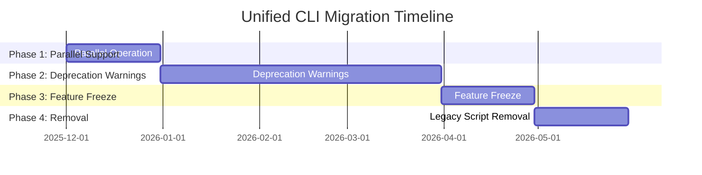

# WhatsApp Bot Scanner - Unified CLI Migration Guide

## 📖 Table of Contents

1. [Migration Overview](#-migration-overview)
2. [Deprecation Timeline](#-deprecation-timeline)
3. [Migration Instructions](#-migration-instructions)
4. [Migration Checklist](#-migration-checklist)
5. [Migration Examples](#-migration-examples)
6. [Backward Compatibility](#-backward-compatibility)
7. [Troubleshooting Migration](#-troubleshooting-migration)
8. [Frequently Asked Questions](#-frequently-asked-questions)

## 🔄 Migration Overview

### Why Migrate?

The unified CLI consolidates all onboarding functionality into a single, cohesive interface with these benefits:

- **Simplified Workflow**: Single command replaces multiple scripts
- **Improved UX**: Visual feedback and progress tracking
- **Better Error Handling**: Clear error messages and recovery options
- **Professional Interface**: Polished CLI with visual elements
- **Future-Proof**: Extensible architecture for new features

### What's Changing?

| Legacy Script            | Unified CLI Equivalent                        | Status     |
| ------------------------ | --------------------------------------------- | ---------- |
| `setup.sh`               | `npx whatsapp-bot-scanner setup`              | Deprecated |
| `setup-hobby-express.sh` | `npx whatsapp-bot-scanner setup --hobby-mode` | Deprecated |
| `watch-pairing-code.js`  | `npx whatsapp-bot-scanner logs wa-client`     | Deprecated |
| `pair.sh`                | `npx whatsapp-bot-scanner pair`               | Deprecated |

## ⏰ Deprecation Timeline

### Migration Phases



### Detailed Timeline

| Phase       | Duration | Start Date | End Date   | Description                                  |
| ----------- | -------- | ---------- | ---------- | -------------------------------------------- |
| **Phase 1** | 30 days  | 2025-12-01 | 2025-12-31 | Parallel support for both old and new CLI    |
| **Phase 2** | 90 days  | 2026-01-01 | 2026-03-31 | Deprecation warnings added to legacy scripts |
| **Phase 3** | 30 days  | 2026-04-01 | 2026-04-30 | Feature freeze on legacy scripts             |
| **Phase 4** | 30 days  | 2026-05-01 | 2026-05-31 | Legacy script removal                        |

### Key Milestones

- **2025-12-01**: Unified CLI released (Current)
- **2026-01-01**: Deprecation warnings begin
- **2026-04-01**: Feature freeze on legacy scripts
- **2026-06-01**: Legacy scripts removed

## 🛠️ Migration Instructions

### Step-by-Step Migration Guide

#### Step 1: Backup Existing Configuration

```bash
# Backup your current configuration
cp .env .env.backup
cp docker-compose.yml docker-compose.yml.backup

# Verify backup
ls -la *.backup
```

#### Step 2: Install Unified CLI

```bash
# Install the unified CLI
npm install -g whatsapp-bot-scanner

# Or use local installation
npm install
```

#### Step 3: Run Migration Wizard

```bash
# Start the migration process
npx whatsapp-bot-scanner setup

# The wizard will:
# 1. Detect your existing configuration
# 2. Prompt for API key migration
# 3. Validate all settings
# 4. Start services with new CLI
```

#### Step 4: Verify Migration

```bash
# Check service health
npx whatsapp-bot-scanner status

# View logs to confirm proper operation
npx whatsapp-bot-scanner logs

# Test WhatsApp pairing
npx whatsapp-bot-scanner pair
```

#### Step 5: Clean Up (Optional)

```bash
# After successful migration, you can remove old scripts
rm setup.sh setup-hobby-express.sh watch-pairing-code.js pair.sh

# Or keep them for reference (recommended during transition)
```

### Migration Command Reference

| Migration Task       | Command                               |
| -------------------- | ------------------------------------- |
| Backup configuration | `cp .env .env.backup`                 |
| Install unified CLI  | `npm install -g whatsapp-bot-scanner` |
| Run migration wizard | `npx whatsapp-bot-scanner setup`      |
| Check service health | `npx whatsapp-bot-scanner status`     |
| View service logs    | `npx whatsapp-bot-scanner logs`       |
| Test pairing         | `npx whatsapp-bot-scanner pair`       |

## ✅ Migration Checklist

### Pre-Migration Checklist

- [ ] Backup existing `.env` file
- [ ] Backup existing `docker-compose.yml`
- [ ] Document current API keys
- [ ] Note any custom configurations
- [ ] Check Docker and Node.js versions
- [ ] Review current service status

### Migration Checklist

- [ ] Install unified CLI package
- [ ] Run migration wizard
- [ ] Validate API key migration
- [ ] Confirm service health
- [ ] Test WhatsApp pairing
- [ ] Verify all functionality
- [ ] Update CI/CD pipelines (if applicable)

### Post-Migration Checklist

- [ ] Monitor services for 24 hours
- [ ] Test all CLI commands
- [ ] Update documentation references
- [ ] Train team members (if applicable)
- [ ] Update monitoring scripts
- [ ] Plan for legacy script removal

## 📋 Migration Examples

### Example 1: Basic Migration

```bash
# 1. Backup current configuration
cp .env .env.backup

# 2. Install unified CLI
npm install -g whatsapp-bot-scanner

# 3. Run migration wizard
npx whatsapp-bot-scanner setup

# 4. Verify migration
npx whatsapp-bot-scanner status
```

### Example 2: Hobby Mode Migration

```bash
# 1. Backup current configuration
cp .env .env.hobby.backup

# 2. Run hobby mode migration
npx whatsapp-bot-scanner setup --hobby-mode

# 3. Verify hobby configuration
npx whatsapp-bot-scanner status
```

### Example 3: Non-Interactive Migration

```bash
# 1. Prepare environment variables
export VT_API_KEY="your_virustotal_key"
export GSB_API_KEY="your_google_key"

# 2. Run non-interactive migration
npx whatsapp-bot-scanner setup --noninteractive

# 3. Verify automated migration
npx whatsapp-bot-scanner status
```

### Example 4: Custom Configuration Migration

```bash
# 1. Backup and prepare custom config
cp .env custom-config.env
nano custom-config.env  # Edit as needed

# 2. Run migration with custom config
npx whatsapp-bot-scanner setup --config custom-config.env

# 3. Verify custom setup
npx whatsapp-bot-scanner status
```

## 🔄 Backward Compatibility

### Compatibility Features

- **Legacy Argument Support**: Old script arguments are automatically mapped
- **Configuration Format**: Existing `.env` files work without modification
- **Docker Compatibility**: Same Docker Compose configurations supported
- **API Key Validation**: Same validation endpoints used

### Compatibility Mapping

| Legacy Argument       | Unified CLI Equivalent |
| --------------------- | ---------------------- |
| `--hobby-mode`        | `--hobby-mode`         |
| `--noninteractive`    | `--noninteractive`     |
| `--skip-dependencies` | `--skip-dependencies`  |

### Compatibility Layer

The unified CLI includes a compatibility layer that:

1. **Detects legacy script usage** and provides migration guidance
2. **Maps legacy arguments** to new CLI options
3. **Preserves existing behavior** for smooth transition
4. **Provides deprecation warnings** with migration instructions

## 🔧 Troubleshooting Migration

### Common Migration Issues

| Issue                      | Solution                                                  |
| -------------------------- | --------------------------------------------------------- |
| Configuration not detected | Run `npx whatsapp-bot-scanner setup --config .env.backup` |
| API keys not migrated      | Manually add keys to new configuration                    |
| Services not starting      | Check Docker daemon and restart services                  |
| Pairing issues             | Use `npx whatsapp-bot-scanner pair` for manual pairing    |
| Permission errors          | Run with appropriate permissions or use `sudo`            |

### Migration Error Recovery

```bash
# Reset and retry migration
rm -rf node_modules package-lock.json
npm install
npx whatsapp-bot-scanner setup

# Force clean migration
docker compose down -v
rm -rf .env docker-data
npx whatsapp-bot-scanner setup
```

### Debugging Migration

```bash
# Verbose migration logging
DEBUG=* npx whatsapp-bot-scanner setup

# Check migration logs
npx whatsapp-bot-scanner logs --tail 100

# Validate configuration
npx whatsapp-bot-scanner setup --noninteractive
```

## ❓ Frequently Asked Questions

### General Questions

**Q: Do I need to uninstall the old scripts?**
A: No, you can keep them during the transition period. They will be automatically deprecated.

**Q: Will my existing configuration work?**
A: Yes, the unified CLI is designed to work with existing `.env` files.

**Q: How long does migration take?**
A: Typically 5-10 minutes, depending on your system and Docker cache.

### Technical Questions

**Q: What if I have custom Docker configurations?**
A: The unified CLI preserves all custom Docker configurations during migration.

**Q: Can I revert to the old scripts?**
A: Yes, you can revert by restoring your backup configuration and using the old scripts.

**Q: Are there any breaking changes?**
A: No breaking changes during the transition period. All functionality is preserved.

### Support Questions

**Q: Where can I get help with migration?**
A: Use `npx whatsapp-bot-scanner compatibility` for migration guidance.

**Q: How do I report migration issues?**
A: Open an issue on GitHub with migration logs and error details.

**Q: Is there a migration checklist?**
A: Yes, see the [Migration Checklist](#-migration-checklist) section above.

## 📚 Additional Resources

- [User Guide](CLI_USER_GUIDE.md)
- [Technical Documentation](CLI_TECHNICAL_DOCUMENTATION.md)
- [Troubleshooting Guide](CLI_TROUBLESHOOTING.md)
- [Architecture Specification](UNIFIED_CLI_TECHNICAL_SPECIFICATION.md)

## 🎯 Migration Success Criteria

Your migration is successful when:

✅ All services show healthy status
✅ WhatsApp pairing works correctly
✅ All API keys are validated
✅ Configuration is properly migrated
✅ No errors in service logs
✅ All functionality works as expected

## 📅 Migration Support Timeline

- **Full Support**: 2025-12-01 to 2026-06-01
- **Limited Support**: 2026-06-01 to 2026-12-01
- **No Support**: After 2026-12-01

Plan your migration accordingly to ensure smooth transition to the unified CLI!
