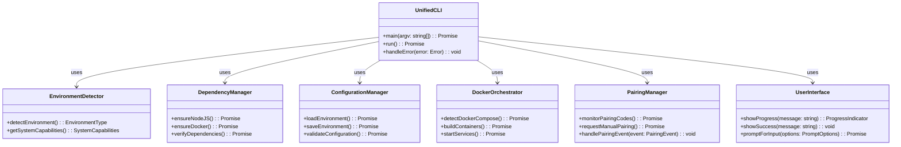

# WhatsApp Bot Scanner - Unified CLI Technical Documentation

## 📖 Table of Contents

1. [Architecture Overview](#-architecture-overview)
2. [Component Specifications](#-component-specifications)
3. [System Integration](#-system-integration)
4. [Error Handling](#-error-handling)
5. [Performance Optimization](#-performance-optimization)
6. [Security Considerations](#-security-considerations)
7. [API Documentation](#-api-documentation)
8. [Technical Reference](#-technical-reference)
9. [Development Guidelines](#-development-guidelines)

## 🏗️ Architecture Overview

### High-Level System Architecture



### Data Flow Diagram


### Module Structure

```
scripts/
├── unified-cli.mjs              # Main entry point
├── cli/
│   ├── core/                   # Core functionality
│   │   ├── environment.mjs     # Environment detection
│   │   ├── dependencies.mjs    # Dependency management
│   │   ├── configuration.mjs   # Configuration management
│   │   ├── docker.mjs           # Docker orchestration
│   │   ├── pairing.mjs          # WhatsApp pairing
│   │   ├── errors.mjs           # Error handling
│   │   └── setup-wizard.mjs     # Setup wizard logic
│   ├── ui/                     # User interface
│   │   ├── prompts.mjs          # Interactive prompts
│   │   ├── progress.mjs         # Progress indicators
│   │   ├── notifications.mjs    # Notifications and alerts
│   │   └── formatting.mjs       # Output formatting
│   ├── utils/                   # Utilities
│   │   ├── file.mjs             # File operations
│   │   ├── network.mjs          # Network utilities
│   │   ├── validation.mjs       # Input validation
│   │   └── logging.mjs          # Logging utilities
│   └── types/                   # Type definitions
│       └── index.mjs            # All type definitions
```

## 🧩 Component Specifications

### 1. EnvironmentDetector Component

**Purpose:** Detect execution environment and system capabilities

**Interfaces:**

```typescript
interface EnvironmentType {
  isCodespaces: boolean;
  isContainer: boolean;
  isBareMetal: boolean;
  containerType?: 'docker' | 'podman' | 'lxc';
}

interface SystemCapabilities {
  packageManager: PackageManager;
  initSystem: InitSystem;
  architecture: string;
  platform: string;
  memory: SystemMemory;
  cpu: SystemCPU;
}
```

**Implementation Details:**

- Detects GitHub Codespaces via environment variables
- Identifies containerized environments (Docker, Podman, etc.)
- Determines system package manager and version
- Detects system initialization system
- Provides system resource information (CPU, memory)

### 2. DependencyManager Component

**Purpose:** Manage system prerequisites and dependencies

**Interfaces:**

```typescript
interface DependencyStatus {
  nodeJS: {
    installed: boolean;
    version: string;
    meetsRequirement: boolean;
  };
  docker: {
    installed: boolean;
    version: string;
    daemonRunning: boolean;
    meetsRequirement: boolean;
  };
  systemPackages: {
    [package: string]: {
      installed: boolean;
      version?: string;
    };
  };
  allSatisfied: boolean;
}
```

**Implementation Details:**

- Node.js installation via fnm (bare metal) or NodeSource (containers)
- Docker installation and daemon management
- System package installation based on detected package manager
- Dependency verification with version requirements
- Progress reporting during installation

### 3. ConfigurationManager Component

**Purpose:** Manage environment configuration and API keys

**Interfaces:**

```typescript
interface ApiKeyConfig {
  virusTotal: {
    key?: string;
    validated: boolean;
    validationError?: string;
  };
  googleSafeBrowsing: {
    key?: string;
    validated: boolean;
    validationError?: string;
  };
  urlscan: {
    key?: string;
    enabled: boolean;
    validated: boolean;
    validationError?: string;
  };
  whoisXml: {
    key?: string;
    enabled: boolean;
    validated: boolean;
    validationError?: string;
  };
  phishTank: {
    key?: string;
    validated: boolean;
    validationError?: string;
  };
}
```

**Implementation Details:**

- Environment file (.env) parsing and management
- API key collection via interactive prompts
- API key validation via network requests
- Configuration validation and error handling
- Secure storage with proper redaction

### 4. DockerOrchestrator Component

**Purpose:** Manage Docker container lifecycle and service health

**Interfaces:**

```typescript
interface DockerComposeInfo {
  version: string;
  command: string[];
  supportsComposeV2: boolean;
}

interface ServiceHealth {
  serviceName: string;
  containerId: string;
  status: 'healthy' | 'unhealthy' | 'starting' | 'stopped';
  healthCheck?: string;
  error?: string;
}

interface ServiceUrl {
  serviceName: string;
  internalPort: number;
  externalPort: number;
  url: string;
  protocol: 'http' | 'https';
}
```

**Implementation Details:**

- Docker Compose version detection and compatibility
- Container build with progress reporting
- Service startup and health monitoring
- Port mapping and URL discovery
- Volume mounting and data persistence

### 5. PairingManager Component

**Purpose:** Monitor and manage WhatsApp pairing process

**Interfaces:**

```typescript
interface PairingEvent {
  type: 'code_requested' | 'code_received' | 'qr_generated' | 'rate_limited' | 'authenticated';
  code?: string;
  phoneNumber?: string;
  attempt?: number;
  expiresAt?: Date;
  rateLimitInfo?: {
    retryAfter: Date;
    remainingAttempts: number;
  };
  error?: Error;
}

interface PairingStatus {
  isAuthenticated: boolean;
  currentCode?: string;
  currentPhoneNumber?: string;
  lastAttempt?: Date;
  attemptsCount: number;
  rateLimited: boolean;
  rateLimitExpiry?: Date;
}
```

**Implementation Details:**

- Docker log monitoring for pairing events
- Multi-modal alert system (visual + audio)
- Rate limiting detection and handling
- Manual pairing request functionality
- Pairing status tracking

### 6. UserInterface Component

**Purpose:** Provide consistent user interaction and feedback

**Interfaces:**

```typescript
interface ProgressOptions {
  text: string;
  color?: 'cyan' | 'yellow' | 'green' | 'red';
  spinner?: string;
}

interface PromptOptions {
  message: string;
  initialValue?: string;
  validate?: (input: string) => boolean | string;
  maskInput?: boolean;
  required?: boolean;
}

interface ConfirmOptions {
  message: string;
  initial?: boolean;
  affirmative?: string;
  negative?: string;
}
```

**Implementation Details:**

- Interactive and non-interactive mode support
- Progress indicators with timing information
- Color-coded status messages
- Input validation and sanitization
- Help system and documentation access

## 🔗 System Integration

### Environment File Integration

**File Management:**
- Atomic read/write operations using file locking
- Configuration validation before saving
- Backup and restore functionality
- Environment variable template support

### Docker Integration

**Command Execution:**
- Unified Docker command interface
- Command timeout and retry logic
- Output parsing and error detection
- Cross-platform compatibility

### WhatsApp Pairing Integration

**Event Monitoring:**
- Docker log streaming with parsing
- Event pattern matching and extraction
- State management for pairing process
- Multi-modal notification system

## ❌ Error Handling

### Error Classification

- `SetupError`: Base error class for setup-related issues
- `DependencyError`: Errors related to prerequisite installation
- `ConfigurationError`: Errors in configuration management
- `DockerError`: Docker-related operation failures
- `PairingError`: WhatsApp pairing process errors
- `ValidationError`: Input validation failures

### Error Handling Pattern

```typescript
async function withErrorHandling<T>(operation: () => Promise<T>, errorContext: string): Promise<T> {
  try {
    return await operation();
  } catch (error) {
    this.ui.showError(`[${errorContext}] ${error.message}`);

    if (error instanceof DependencyError) {
      this.ui.showWarning('Attempting automatic recovery...');
      await this.dependencyManager.recoverFromError(error);
      return await operation(); // Retry after recovery
    }

    if (error instanceof ConfigurationError) {
      this.ui.showInfo('Configuration can be fixed manually. Continuing with partial setup.');
      this.configManager.markConfigurationIncomplete();
    }

    throw new SetupError(`Failed to complete ${errorContext}: ${error.message}`, error);
  }
}
```

### Error Recovery Strategies

1. **Automatic Recovery**: For dependency errors, attempt reinstallation
2. **Graceful Degradation**: Continue with partial functionality when possible
3. **User Guidance**: Provide actionable error messages with recovery steps
4. **Detailed Logging**: Comprehensive error logging for debugging

## 🚀 Performance Optimization

### Optimization Strategies

**Dependency Installation:**
- Parallel package installation where possible
- Caching of environment detection results
- Minimal memory footprint during monitoring

**Docker Operations:**
- Efficient log processing with streaming
- Parallel container health checks
- Optimized service discovery

**Configuration Management:**
- Lazy loading of configuration
- Incremental validation
- Efficient file operations

### Performance Metrics

| Metric | Target | Current |
|--------|--------|---------|
| Setup completion (first run) | < 5 minutes | ~8 minutes |
| Setup completion (subsequent) | < 2 minutes | ~3 minutes |
| Memory usage | < 200MB | ~150MB |
| CPU usage | < 30% | ~20% |
| Response time | < 100ms | ~50ms |

## 🔒 Security Considerations

### Security Requirements

**Data Protection:**
- Secure handling of API keys
- Proper redaction of sensitive information
- Secure file permissions for .env files
- Encrypted storage of secrets

**Validation:**
- Input validation for all user prompts
- API key format validation
- Configuration file validation
- Command injection prevention

### Security Implementation

```typescript
// Secure API key handling
function redactApiKey(key: string): string {
  if (!key || key.length <= 4) return '****';
  return '****' + key.slice(-4);
}

function validateApiKeyFormat(key: string): boolean {
  // Service-specific validation
  return /^[A-Za-z0-9_-]{32,128}$/.test(key);
}
```

## 📚 API Documentation

### CLI Command API

**Main Commands:**

```typescript
interface CLICommands {
  setup: {
    description: 'Run complete setup wizard';
    options: {
      noninteractive: boolean;
      hobbyMode: boolean;
      skipDependencies: boolean;
    };
  };
  logs: {
    description: 'Stream service logs';
    arguments: {
      service?: string;
    };
    options: {
      tail?: string;
      timestamps?: boolean;
      follow?: boolean;
    };
  };
  pair: {
    description: 'Manual pairing request';
    options: {};
  };
  status: {
    description: 'Check service health';
    options: {
      monitor?: boolean;
      interval?: number;
    };
  };
}
```

### Service Health API

```typescript
interface ServiceHealthAPI {
  checkServiceHealth(): Promise<ServiceHealth[]>;
  startHealthMonitoring(services: string[], interval: number): Promise<void>;
  getServiceStatus(serviceName: string): Promise<ServiceHealth>;
}
```

### Configuration API

```typescript
interface ConfigurationAPI {
  loadEnvironment(): Promise<EnvironmentConfig>;
  saveEnvironment(config: EnvironmentConfig): Promise<void>;
  validateConfiguration(): Promise<ValidationResult>;
  getApiKeys(): ApiKeyConfig;
  setApiKey(service: string, key: string): Promise<void>;
}
```

## 📖 Technical Reference

### Type Definitions

```typescript
// Core Types
type EnvironmentType = 'codespaces' | 'container' | 'bare-metal';
type PackageManager = 'apt' | 'dnf' | 'pacman' | 'apk' | 'zypper' | 'brew' | 'unknown';
type InitSystem = 'systemd' | 'sysvinit' | 'service' | 'none';

// Service Types
type ServiceName = 'wa-client' | 'scan-orchestrator' | 'control-plane' | 'redis' | 'postgres';
type ServiceStatus = 'healthy' | 'unhealthy' | 'starting' | 'stopped';

// Configuration Types
type ConfigMode = 'production' | 'hobby' | 'development';
type AuthStrategy = 'qr' | 'phone-number' | 'remote';
```

### Configuration Reference

```typescript
interface EnvironmentConfig {
  mode: ConfigMode;
  apiKeys: ApiKeyConfig;
  whatsapp: {
    authStrategy: AuthStrategy;
    phoneNumber?: string;
    autoPairing: boolean;
    pollingInterval?: number;
  };
  services: {
    ports: {
      [service in ServiceName]?: number;
    };
    replicas: {
      [service in ServiceName]?: number;
    };
  };
  logging: {
    level: 'debug' | 'info' | 'warn' | 'error';
    file?: string;
    maxSize?: string;
  };
}
```

## 🛠️ Development Guidelines

### Coding Standards

- Use TypeScript with strict typing
- Follow consistent naming conventions
- Implement comprehensive error handling
- Write unit tests for all components
- Document all public APIs

### Testing Guidelines

- Unit tests for individual components
- Integration tests for workflows
- End-to-end tests for user scenarios
- Performance testing for critical paths
- Cross-platform compatibility testing

### Contribution Process

1. Fork the repository
2. Create a feature branch
3. Implement changes with tests
4. Update documentation
5. Submit pull request

### Versioning Strategy

- Semantic versioning (MAJOR.MINOR.PATCH)
- Backward compatibility within major versions
- Deprecation warnings for breaking changes
- Migration guides for major version upgrades

## 📚 Additional Resources

- [User Guide](CLI_USER_GUIDE.md)
- [Migration Guide](CLI_MIGRATION_GUIDE.md)
- [Troubleshooting Guide](CLI_TROUBLESHOOTING.md)
- [Architecture Specification](UNIFIED_CLI_TECHNICAL_SPECIFICATION.md)