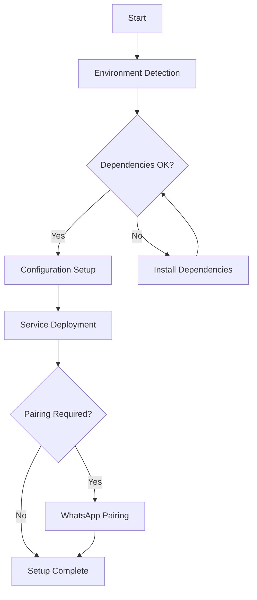
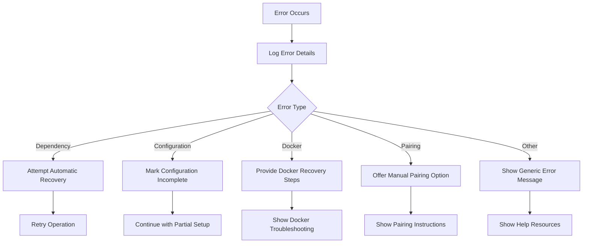
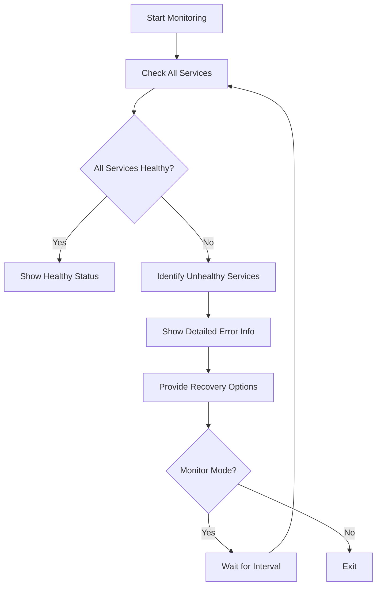

# WhatsApp Bot Scanner - Unified CLI Visual Aids

## 📖 Table of Contents

1. [ASCII Diagrams](#-ascii-diagrams)
2. [Flowcharts](#-flowcharts)
3. [Usage Examples](#-usage-examples)
4. [Visual Guides](#-visual-guides)
5. [Reference Tables](#-reference-tables)
6. [Command Cheat Sheet](#-command-cheat-sheet)
7. [Configuration Templates](#-configuration-templates)

## 🖼️ ASCII Diagrams

### System Architecture Diagram

```
┌───────────────────────────────────────────────────────────────────────────────┐
│                            WhatsApp Bot Scanner System                            │
├───────────────────────────────────────────────────────────────────────────────┤
│                                                                                   │
│  ┌─────────────┐    ┌─────────────┐    ┌─────────────────┐    ┌─────────────┐  │
│  │  User Input  │    │  Environment │    │  Configuration  │    │  Docker      │  │
│  │  (CLI)       │    │  Detection   │    │  Management     │    │  Orchestration│  │
│  └──────┬───────┘    └──────┬───────┘    └────────┬────────┘    └──────┬───────┘  │
│         │                  │                    │                    │          │
│         ▼                  ▼                    ▼                    ▼          │
│  ┌───────────────────────────────────────────────────────────────────────┐  │
│  │                        Unified CLI Core                            │  │
│  └───────────────────────────────────────────────────────────────────────┘  │
│                                                                                   │
│  ┌─────────────┐    ┌─────────────┐    ┌─────────────────┐    ┌─────────────┐  │
│  │  Pairing     │    │  Service     │    │  Health          │    │  User       │  │
│  │  Management  │    │  Management  │    │  Monitoring      │    │  Interface  │  │
│  └─────────────┘    └─────────────┘    └─────────────────┘    └─────────────┘  │
│                                                                                   │
└───────────────────────────────────────────────────────────────────────────────┘
```

### Setup Process Flow

```
┌───────────────────────────────────────────────────────────────────────────────┐
│                            Unified CLI Setup Process                              │
├───────────────────────────────────────────────────────────────────────────────┤
│                                                                                   │
│  Step 1: Environment Detection                                                  │
│  ┌───────────────────────────────────────────────────────────────────────┐  │
│  │  • Detect operating system and architecture                                │  │
│  │  • Identify container vs bare metal environment                            │  │
│  │  • Determine package manager and init system                               │  │
│  │  • Check system resources (CPU, memory, disk)                            │  │
│  └───────────────────────────────────────────────────────────────────────┘  │
│                                                                                   │
│  Step 2: Dependency Verification                                                 │
│  ┌───────────────────────────────────────────────────────────────────────┐  │
│  │  • Verify Node.js installation and version                                  │  │
│  │  • Check Docker and Docker Compose availability                            │  │
│  │  • Validate system package dependencies                                     │  │
│  │  • Install missing dependencies automatically                             │  │
│  └───────────────────────────────────────────────────────────────────────┘  │
│                                                                                   │
│  Step 3: Configuration Management                                               │
│  ┌───────────────────────────────────────────────────────────────────────┐  │
│  │  • Load or create .env configuration file                                   │  │
│  │  • Collect API keys via interactive prompts                                  │  │
│  │  • Validate API key formats and connectivity                                 │  │
│  │  • Set up WhatsApp authentication strategy                                   │  │
│  └───────────────────────────────────────────────────────────────────────┘  │
│                                                                                   │
│  Step 4: Service Deployment                                                       │
│  ┌───────────────────────────────────────────────────────────────────────┐  │
│  │  • Build Docker containers with progress tracking                            │  │
│  │  • Start services in correct dependency order                                │  │
│  │  • Monitor service health during startup                                    │  │
│  │  • Display service URLs and access information                              │  │
│  └───────────────────────────────────────────────────────────────────────┘  │
│                                                                                   │
│  Step 5: WhatsApp Pairing                                                         │
│  ┌───────────────────────────────────────────────────────────────────────┐  │
│  │  • Monitor pairing codes from Docker logs                                     │  │
│  │  • Display pairing instructions and QR codes                                 │  │
│  │  • Provide multi-modal notifications (visual + audio)                       │  │
│  │  • Handle rate limiting and error conditions                                  │  │
│  └───────────────────────────────────────────────────────────────────────┘  │
│                                                                                   │
└───────────────────────────────────────────────────────────────────────────────┘
```

### Command Structure

```
┌───────────────────────────────────────────────────────────────────────────────┐
│                            Unified CLI Command Structure                         │
├───────────────────────────────────────────────────────────────────────────────┤
│                                                                                   │
│  npx whatsapp-bot-scanner [command] [options]                                    │
│                                                                                   │
│  Main Commands:                                                                   │
│  ┌───────────────────────────────────────────────────────────────────────┐  │
│  │  • setup          - Run complete setup wizard                              │  │
│  │  • logs           - Stream service logs                                    │  │
│  │  • pair           - Manual pairing request                                 │  │
│  │  • status         - Check service health                                   │  │
│  │  • compatibility   - Show migration information                            │  │
│  └───────────────────────────────────────────────────────────────────────┘  │
│                                                                                   │
│  Setup Options:                                                                  │
│  ┌───────────────────────────────────────────────────────────────────────┐  │
│  │  • --noninteractive      - Run without prompts                             │  │
│  │  • --hobby-mode          - Configure for personal use                      │  │
│  │  • --skip-dependencies   - Skip dependency checks                           │  │
│  │  • --config <file>       - Use custom configuration file                   │  │
│  └───────────────────────────────────────────────────────────────────────┘  │
│                                                                                   │
│  Log Options:                                                                   │
│  ┌───────────────────────────────────────────────────────────────────────┐  │
│  │  • --tail <lines>       - Number of lines to show                          │  │
│  │  • --timestamps         - Show timestamps in logs                          │  │
│  │  • --no-follow          - Don't follow logs (show once)                    │  │
│  │  • [service]            - Specific service to view                           │  │
│  └───────────────────────────────────────────────────────────────────────┘  │
│                                                                                   │
└───────────────────────────────────────────────────────────────────────────────┘
```

## 📊 Flowcharts

### Setup Process Flowchart



### Error Handling Flowchart



### Service Health Monitoring Flowchart



## 💻 Usage Examples

### Basic Setup Example

```bash
# Interactive setup with all defaults
npx whatsapp-bot-scanner setup

# Expected output:
# 1. Environment detection progress
# 2. API key collection prompts
# 3. Service deployment with spinners
# 4. Pairing code display (if needed)
# 5. Completion message with service URLs
```

### Non-Interactive Setup Example

```bash
# Non-interactive setup for CI/CD
export VT_API_KEY="your_virustotal_key"
export GSB_API_KEY="your_google_key"
npx whatsapp-bot-scanner setup --noninteractive

# Expected output:
# - Automatic configuration using environment variables
# - Progress indicators without prompts
# - Service startup with minimal output
# - Success/failure exit codes
```

### Service Management Example

```bash
# Check service health with monitoring
npx whatsapp-bot-scanner status --monitor --interval 3000

# Expected output:
# ┌─────────────────────────────────────────────────────────────────┐
# │  Service Health Monitoring (Updated every 3s)                  │
# ├─────────────────────────────────────────────────────────────────┤
# │  ✅ wa-client: Healthy (Container: abc123)                       │
# │  ✅ scan-orchestrator: Healthy (Container: def456)               │
# │  ✅ control-plane: Healthy (Container: ghi789)                   │
# │  ✅ redis: Healthy (Container: jkl012)                           │
# │  ✅ postgres: Healthy (Container: mno345)                         │
# │                                                                 │
# │  Press Ctrl+C to stop monitoring...                             │
# └─────────────────────────────────────────────────────────────────┘
```

### Log Viewing Example

```bash
# View last 50 lines of wa-client logs with timestamps
npx whatsapp-bot-scanner logs wa-client --tail 50 --timestamps

# Expected output:
# [2025-12-02 08:45:00] INFO: Starting WhatsApp client...
# [2025-12-02 08:45:05] INFO: Loading session from cache...
# [2025-12-02 08:45:10] WARN: No cached session found
# [2025-12-02 08:45:15] INFO: Requesting new pairing code...
# [2025-12-02 08:45:20] INFO: Pairing code: ABC1-DEF2
```

## 🎨 Visual Guides

### Pairing Code Display

```
┌───────────────────────────────────────────────────────────────────────────────┐
│                            WhatsApp Pairing Required                            │
├───────────────────────────────────────────────────────────────────────────────┤
│                                                                                   │
│  Your pairing code is:  4X7K-2M9P                                                  │
│                                                                                   │
│  ┌───────────────────────────────────────────────────────────────────────┐  │
│  │                                                                           │  │
│  │     4X7K-2M9P                                                               │  │
│  │                                                                           │  │
│  │     ⏱️  Expires in: 1:45                                                   │  │
│  │                                                                           │  │
│  │     Open WhatsApp → Settings → Linked Devices                            │  │
│  │     → Link a Device → Enter this code                                    │  │
│  │                                                                           │  │
│  └───────────────────────────────────────────────────────────────────────┘  │
│                                                                                   │
│  [Press ENTER when pairing is complete, or R to request new code]              │
│                                                                                   │
└───────────────────────────────────────────────────────────────────────────────┘
```

### Service Health Display

```
┌───────────────────────────────────────────────────────────────────────────────┐
│                            Service Health Status                                 │
├───────────────────────────────────────────────────────────────────────────────┤
│                                                                                   │
│  Service: wa-client                                                               │
│  Status: ✅ Healthy                                                               │
│  Container: abc1234567890                                                         │
│  Uptime: 2 hours, 15 minutes                                                     │
│  Memory: 128MB / 512MB                                                             │
│  CPU: 5%                                                                          │
│  Last Check: 2025-12-02 08:46:00                                                  │
│                                                                                   │
│  Service: scan-orchestrator                                                      │
│  Status: ✅ Healthy                                                               │
│  Container: def9876543210                                                         │
│  Uptime: 2 hours, 14 minutes                                                     │
│  Memory: 256MB / 1GB                                                              │
│  CPU: 12%                                                                         │
│  Last Check: 2025-12-02 08:46:00                                                  │
│                                                                                   │
│  Service: control-plane                                                          │
│  Status: ✅ Healthy                                                               │
│  Container: ghi5556667778                                                        │
│  Uptime: 2 hours, 13 minutes                                                     │
│  Memory: 96MB / 256MB                                                             │
│  CPU: 3%                                                                          │
│  Last Check: 2025-12-02 08:46:00                                                  │
│                                                                                   │
└───────────────────────────────────────────────────────────────────────────────┘
```

### Progress Indicator Examples

```
# Environment Detection
⠼ Detecting environment... (1/5)
✅ Environment detected: Ubuntu 22.04 LTS (Bare Metal)

# Dependency Check
⠋ Checking dependencies... (2/5)
✅ Node.js 20.4.0 - OK
✅ Docker 24.0.5 - OK
✅ Docker Compose v2 - OK

# Configuration Setup
⠦ Setting up configuration... (3/5)
🔑 VirusTotal API Key: ●●●●●●●●●●●●●●●●●●●●
✅ API key validated successfully

# Service Deployment
⠧ Deploying services... (4/5)
📦 Building containers...
✅ wa-client built
✅ scan-orchestrator built
✅ control-plane built
🚀 Starting services...
✅ All services started

# WhatsApp Pairing
⠇ Setting up WhatsApp pairing... (5/5)
📱 Waiting for pairing code...
🔑 Pairing code received: 4X7K-2M9P
⏱️ Code expires in: 2:00
```

## 📋 Reference Tables

### Command Reference Table

| Command | Description | Options | Example |
|---------|-------------|---------|---------|
| `setup` | Complete setup wizard | `--noninteractive`, `--hobby-mode`, `--skip-dependencies` | `npx whatsapp-bot-scanner setup` |
| `logs` | Stream service logs | `--tail <lines>`, `--timestamps`, `--no-follow`, `[service]` | `npx whatsapp-bot-scanner logs wa-client --tail 50` |
| `pair` | Manual pairing | None | `npx whatsapp-bot-scanner pair` |
| `status` | Service health | `--monitor`, `--interval <ms>` | `npx whatsapp-bot-scanner status --monitor` |
| `compatibility` | Migration info | None | `npx whatsapp-bot-scanner compatibility` |

### Service Reference Table

| Service | Port | Description | Health Check |
|----------|------|-------------|--------------|
| `wa-client` | 3000 | WhatsApp automation client | `/healthz` |
| `scan-orchestrator` | 3001 | URL scanning orchestrator | `/healthz` |
| `control-plane` | 3002 | Admin API and control plane | `/healthz` |
| `redis` | 6379 | Redis cache and queue | Built-in |
| `postgres` | 5432 | PostgreSQL database | Built-in |

### API Key Reference Table

| Service | Environment Variable | Required | Validation Endpoint |
|----------|----------------------|----------|---------------------|
| VirusTotal | `VT_API_KEY` | ✅ Yes | `https://www.virustotal.com/api/v3/ip_addresses/8.8.8.8` |
| Google Safe Browsing | `GSB_API_KEY` | ❌ No | `https://safebrowsing.googleapis.com/v4/threatMatches:find` |
| URLScan | `URLSCAN_API_KEY` | ❌ No | `https://urlscan.io/api/v1/scan/` |
| WhoisXML | `WHOISXML_API_KEY` | ❌ No | `https://www.whoisxmlapi.com/whoisserver/WhoisService` |

### Configuration Reference Table

| Configuration | Environment Variable | Default | Description |
|----------------|----------------------|---------|-------------|
| Mode | `MODE` | `production` | `production`, `hobby`, or `development` |
| WhatsApp Auth | `WHATSAPP_AUTH` | `qr` | `qr`, `phone-number`, or `remote` |
| Log Level | `LOG_LEVEL` | `info` | `debug`, `info`, `warn`, or `error` |
| Max Log Size | `LOG_MAX_SIZE` | `10m` | Maximum log file size |
| API Timeout | `API_TIMEOUT` | `10000` | API request timeout in ms |

## 📋 Command Cheat Sheet

### Quick Reference

```bash
# Setup
npx whatsapp-bot-scanner setup
npx whatsapp-bot-scanner setup --noninteractive
npx whatsapp-bot-scanner setup --hobby-mode

# Service Management
npx whatsapp-bot-scanner status
npx whatsapp-bot-scanner status --monitor
npx whatsapp-bot-scanner logs
npx whatsapp-bot-scanner logs wa-client --tail 100

# Pairing
npx whatsapp-bot-scanner pair
npx whatsapp-bot-scanner logs wa-client  # Monitor pairing

# Configuration
cp .env.example .env
nano .env
npx whatsapp-bot-scanner setup --validate

# Troubleshooting
docker compose restart
docker compose logs
docker stats
npx whatsapp-bot-scanner status --monitor
```

### Common Workflows

**Basic Setup:**
```bash
git clone https://github.com/your-repo/whatsapp-bot-scanner.git
cd whatsapp-bot-scanner
npx whatsapp-bot-scanner setup
```

**Hobby Mode Setup:**
```bash
git clone https://github.com/your-repo/whatsapp-bot-scanner.git
cd whatsapp-bot-scanner
npx whatsapp-bot-scanner setup --hobby-mode
```

**CI/CD Deployment:**
```bash
export VT_API_KEY="your_key"
export GSB_API_KEY="your_key"
npx whatsapp-bot-scanner setup --noninteractive
```

**Service Monitoring:**
```bash
npx whatsapp-bot-scanner status --monitor --interval 5000
```

## 📝 Configuration Templates

### Basic Configuration Template

```ini
# .env - Basic Configuration Template

# Mode (production, hobby, development)
MODE=production

# API Keys
VT_API_KEY=your_virustotal_api_key
GSB_API_KEY=your_google_safe_browsing_key
URLSCAN_API_KEY=your_urlscan_api_key
WHOISXML_API_KEY=your_whoisxml_api_key

# WhatsApp Configuration
WHATSAPP_AUTH=qr
WHATSAPP_PHONE_NUMBER=
WHATSAPP_AUTO_PAIRING=true

# Service Ports
WA_CLIENT_PORT=3000
SCAN_ORCHESTRATOR_PORT=3001
CONTROL_PLANE_PORT=3002

# Logging
LOG_LEVEL=info
LOG_MAX_SIZE=10m
```

### Hobby Configuration Template

```ini
# .env - Hobby Configuration Template

# Mode
MODE=hobby

# API Keys (VirusTotal required, others optional)
VT_API_KEY=your_virustotal_api_key
# GSB_API_KEY=your_google_safe_browsing_key
# URLSCAN_API_KEY=your_urlscan_api_key
# WHOISXML_API_KEY=your_whoisxml_api_key

# WhatsApp Configuration
WHATSAPP_AUTH=qr
WHATSAPP_AUTO_PAIRING=true

# Service Ports (hobby defaults)
WA_CLIENT_PORT=3000
SCAN_ORCHESTRATOR_PORT=3001
CONTROL_PLANE_PORT=3002

# Logging (reduced for hobby)
LOG_LEVEL=info
LOG_MAX_SIZE=5m
```

### Production Configuration Template

```ini
# .env - Production Configuration Template

# Mode
MODE=production

# API Keys (all recommended for production)
VT_API_KEY=your_virustotal_api_key
GSB_API_KEY=your_google_safe_browsing_key
URLSCAN_API_KEY=your_urlscan_api_key
WHOISXML_API_KEY=your_whoisxml_api_key

# WhatsApp Configuration
WHATSAPP_AUTH=remote
WHATSAPP_PHONE_NUMBER=+1234567890
WHATSAPP_AUTO_PAIRING=true
WHATSAPP_POLLING_INTERVAL=30000

# Service Configuration
WA_CLIENT_REPLICAS=2
SCAN_ORCHESTRATOR_REPLICAS=2

# Service Ports
WA_CLIENT_PORT=3000
SCAN_ORCHESTRATOR_PORT=3001
CONTROL_PLANE_PORT=3002

# Performance
API_TIMEOUT=15000
SCAN_CONCURRENCY=5

# Logging
LOG_LEVEL=info
LOG_MAX_SIZE=50m
LOG_FILE=/var/log/whatsapp-bot-scanner.log
```

## 📚 Additional Resources

- [User Guide](CLI_USER_GUIDE.md)
- [Technical Documentation](CLI_TECHNICAL_DOCUMENTATION.md)
- [Migration Guide](CLI_MIGRATION_GUIDE.md)
- [Troubleshooting Guide](CLI_TROUBLESHOOTING.md)

## 🎯 Visual Aid Best Practices

1. **Use ASCII diagrams** for system architecture visualization
2. **Create flowcharts** for complex process explanations
3. **Provide usage examples** with expected output
4. **Include visual guides** for interactive elements
5. **Add reference tables** for quick command lookup
6. **Use consistent formatting** for better readability
7. **Keep visuals simple** and focused on key concepts
8. **Update visuals** when documentation changes